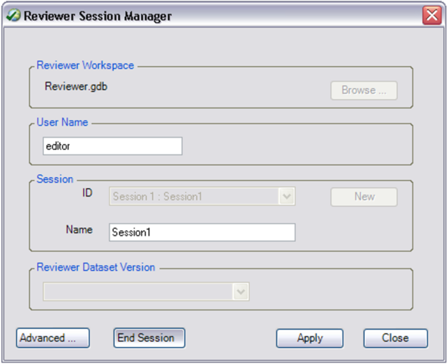

## S-58 Log File Parser

ENCs created by ArcGIS for Maritime: Charting can be analyzed in third-party validation software to validate the data against S-58. Once the data is validated, the log file can be parsed by the ParseS58LogFile.exe tool to import errors and warnings as records in the Reviewer table.

This repository contains tools that complement the ArcGIS for Maritime: Charting extension. Learn more about ArcGIS for Maritime: Charting [here](http://www.esri.com/software/arcgis/extensions/maritime/charting)

[View some of these tools in action](https://www.youtube.com/channel/UC3TLoqZ0pAY9CU3ff58k3rg/)

## Features: 
* parse validation log files generated by dKart Inspector 6.x (from C-MAP) and ENC Analyzer 3.4 (from SevenCs)
* Importing S-58 validation results into the Reviewer table

## Requirements

* ArcMap 10.4.1
* ArcGIS for Maritime: Charting 10.4.1

## Limitations: 
* Support for dKart Inspector log files is limited to Log File format (\*.log). The Verification XML report format (\*.xml) is not supported.

## Instructions

1. Download both ParseS58LogUI.exe and ParseS58LogFile.exe and place them in the same folder.
2. Double click ParseS58LogUI.exe.

  The Parse S-58 Log File dialog appears

  

3. For the S-58 Log File parameter, browse to the location of the log file generated by the 3rd party validation software.
4. For the S-57 File, browse to the location of the S-57 cell that was used to generate the 3rd party log file.
5. For the Production Database, browse to the location of the geodatabase, or connection file, that contains the data that was used to generate the S-57 cell.
6. If you already have a Data Reviewer Workspace, you may browse to it using the optional Data Reviewer Workspace parameter. If you do not populate this parameter, a Data Reviewer workspace is created for you in same directory as the S-57 cell.
7. Click OK to run the tool.
8. You can now start a reviewer session to resolve the errors and warnings in ArcMap with the resulting data reviewer workspace and the Production Database.

## Starting the Reviewer session and opening the Reviewer table
Once the validation results are imported into the Reviewer table, you can query, select, modify, and manage these records.

1. Open ArcMap.
2. On the main menu, click Customize > Toolbars > Data Reviewer. 
3. Click the Reviewer Session Manager button  on the Data Reviewer toolbar. 

  The Reviewer Session Manager dialog box appears.

  

4. Click Browse and browse to the Reviewer workspace that was created by the ParseS58LogFile.exe tool. 
5. Click Add. 
6. Click the ID drop-down arrow and select the session associated with the validation results you would like to review. 
7. Click Start Session. 
8. Click Close. 
9. Add the necessary Production Database feature classes to the Table Of Contents window. 
10. Click the Reviewer Table button  on the Data Reviewer toolbar. 

In the Reviewer table, you can zoom to, pan to, select, and evaluate individual errors that have been recorded so that they can be corrected. If there is a feature to write the error back to, it is represented in the Data Reviewer table as a Feature Geometry. If there are coordinates given in the third party validation output, a Reviewer Geometry is created. In ENC Analyzer version 3.4, coordinates are provided for certain types of errors, as well as for errors related to SOUNDG objects. As a result, not all records have a Reviewer Geometry. Since there are no primitives in the NIS, there are no Feature Geometries, and only a Reviewer Geometry. 

## Resources

* [Product pages](http://www.esri.com/software/arcgis/extensions/maritime/charting/)

## Issues

Find a bug or want to request a new feature?  Please let us know by submitting an issue.

## Contributing

Esri welcomes contributions from anyone and everyone. Please see our [guidelines for contributing](https://github.com/esri/contributing).

## Licensing
Copyright 2016 Esri

Licensed under the Esri License Agreement(the "License");
you may not use this file except in compliance with the License.
You may obtain a copy of the License at

   http://www.esri.com/legal/software-license
   
Unless required by applicable law or agreed to in writing, software
distributed under the License is distributed on an "AS IS" BASIS,
WITHOUT WARRANTIES OR CONDITIONS OF ANY KIND, either express or implied.
See the License for the specific language governing permissions and
limitations under the License.
