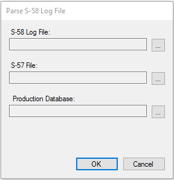
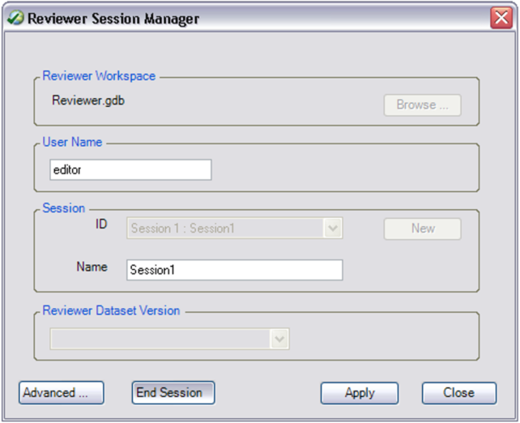

# Importing S-58 validation results into the Reviewer table

ENCs created by ArcGIS for Maritime: Charting can be analyzed in third-party validation software to validate the data against S-58. Once the data is validated, the log file can be parsed by the ParseS58LogFile.exe tool to import errors and warnings as records in the Reviewer table.

The ParseS58LogFile.exe tool parses validation log files generated by dKart Inspector 6.x (from C-MAP) and ENC Analyzer 3.4 (from SevenCs). Support for dKart Inspector log files is limited to Log File format (\*.log). The Verification XML report format (\*.xml) is not supported.

# Writing the S-58 validation results to the Reviewer table 

1. Double click ParseS58LogUI.exe

  The Parse S-58 Log File dialog appears

  

2. For the S-58 Log File parameter, browse to the location of the log file generated by the 3rd party validation software.
3. For the S-57 File, browse to the location of the S-57 cell that was used to generate the 3rd party log file.
4. For the Production Database, browse to the location of the geodatabase, or connection file, that contains the data that was used to generate the S-57 cell.
5. Click OK to run the tool.
6. A Data Reviewer workspace is created in same directory as the S-57 cell.
7. You can now start a reviewer session to resolve the errors and warnings in ArcMap with the resulting data reviewer workspace and the Production Database.

# Starting the Reviewer session and opening the Reviewer table
Once the validation results are imported into the Reviewer table, you can query, select, modify, and manage these records.

1. Open ArcMap.
2. On the main menu, click Customize > Toolbars > Data Reviewer. 
3. Click the Reviewer Session Manager button  on the Data Reviewer toolbar. 

The Reviewer Session Manager dialog box appears.

4. Click Browse and browse to the Reviewer workspace that was created by the ParseS58LogFile.exe tool. 
5. Click Add. 
6. Click the ID drop-down arrow and select the session associated with the validation results you would like to review. 
7. Click Start Session. 
8. Click Close. 
9. Add the necessary Production Database feature classes to the Table Of Contents window. 
10. Click the Reviewer Table button  on the Data Reviewer toolbar. 

In the Reviewer table, you can zoom to, pan to, select, and evaluate individual errors that have been recorded so that they can be corrected.

Tool requirements:
* ArcMap 10.4.1 with ArcGIS for Maritime: Charting 10.4.1
* ArcGIS Data Reviewer 10.4.1

Overview of materials provided:
* S57 To GIS.tbx – toolbox containing the python script
* s57_to_gis– configurable Python script file.
* NO_SCAMIN_TEMPLATE.mxd – map document with layers and labels preset for S-52 rendering.
* SCAMIN_TEMPLATE.mxd – map document with 5 scaleband-based group layers preset for S-52 rendering. The scaleband-based group layers turn on and off as you zoom in and out, providing Bing/Google maps style drawing behavior in the map document.
* S57_GIS.gdb – A preconfigured geodatabase template schema.

Overview of tool functions:
* This script iterates through the contents of the **Input Directory** parameter and finds all S-57 cells and their associated updates.
* The list of cells is then imported into the workspace defined in the **Target Workspace** parameter.
* Once the import process is complete, the script calculates S-52 on the geodatabase
* Lastly, the script resources the feature classes from the Target Workspace to the map document selected in the **Map Document** parameter. It also zooms the data frame in the map document to the extent of all of all the Meta polygon features (M_QUAL, for example).

# Steps to use S57 To GIS

Note: Each time you want to use the tool, make a copy of the S57_GIS.gdb and one of the provided map
documents, keeping the originals as a template that can be reused. 

1. Open ArcMap
2. In ArcMap, open the ArcCatalog window and navigate to the location of the S57 To GIS.tbx.
3. Expand **S57 To GIS.tbx**

4. Double click the S57 To GIS tool to open it.

5. For the **Input Directory**, browse to the location of the cells(s) you want to import
Note: The cells in the input directory can be in either the US or International exchange set
format, or they can simply be contained under the Input Directory in no particular structure.
6. For the **Target Workspace**, browse to the location of the geodatabase you want to import into.
7. For **Map Document**, choose a template map document for visualizing the output.
8. Click OK
The cells are imported, the data is symbolized, and the map document is resourced and zoomed
to the target workspace data.
